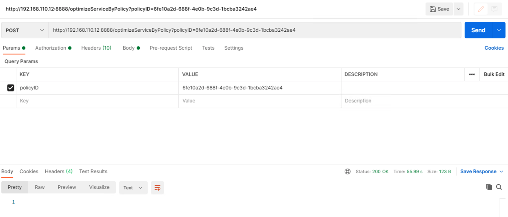
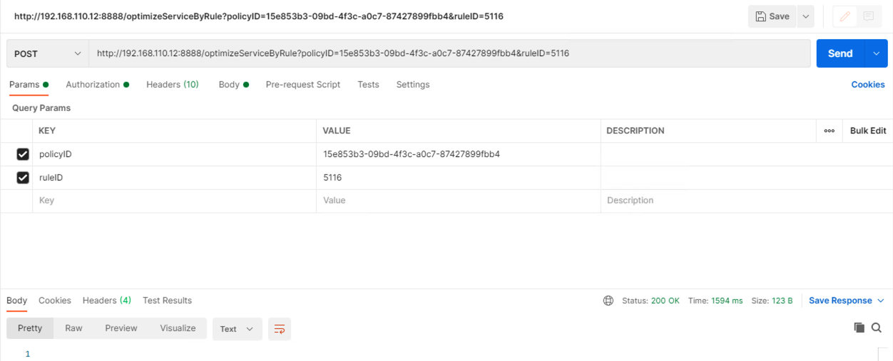

# NSX-T DFW Rule Optimizer

Contributors : Riaz Mohamed (@riazvm) & Sobana Thirunavukkarasu

## What does this do? 
The application consolidates service entrys in a rule within a security policy which helps reduce rule explosion in 
the Data Plane in NSX. This results in lowering performance issues resulting from multiple rule evaluations. NSX-T allows
a maximum  of 15 service entries for tcp and udp in a single service entity.  We constantly see customer situations where 
this feature is not used and mostly see multiple services being configured for a rule with only one service entry each. 
NSX-T 3x evaluates and correct's there internally but with prior versions of NSX this needs to be done manually. Our 
code helps with consolidating the TCP and UDP entries within a rule. New Services are created with the following ID 
ruleID + "-DST-" + protocol + "-SE-" + counter

NOTE: tcp and udp entries are consolidated into 15 entries each for a rule , ranges are consolidated as a seperate Service 
with 7 entries each.

## Code 
The code is writen in Java Spring boot and containerized as a docker image. 

## Running the application
 
We have build the application and uploaded to docker hub. You could run the public version of the image or build your own and run 

To run the public image which has already been build


1. Clone the github repository

```
https://github.com/riazvm/dfwruleoptimizer

```

2. Install docker and docker-compose if you do not have it already

[install docker](https://docs.docker.com/engine/install/))

[install docker-compose](https://docs.docker.com/compose/install/)


3. Modify the docker-compose.yml file to update the following

      - NSX-IP=xxxxx
      - NSX-USER=admin
      - NSX-PASSWORD=xxxxx
      - NSX-RULE-SERVICE-COUNT=1

NSX-RULE-SERVICE-COUNT denotes if number of services in the rule is greater than the nuber of services specified in NSX-RULE-SERVICE-COUNT variable then the rule will be optimized
   

4. Run the application
```
docker-compose up
```
NOTE: The service and the service entries created will have the following naming format
  IF not range then <FIRSTIP-IN-SERVICEENTRYLIST>-<LASTIP-IN-SERVICEENTRYLIST>-DST-<PROTOCOL>-<SERVICE-TYPE>-<ITERATORVALUE>-<FIRST OCTET OF RULEID if a - esists>
  
  IF range then <FIRSTIP-IN-SERVICEENTRYLIST>-<LASTIP-IN-SERVICEENTRYLIST>-R-DST-<PROTOCOL>-<SERVICE-TYPE>-<ITERATORVALUE> -<FIRST OCTET OF RULEID if a - esists>

Eg. If a TCP Service with Service Entries 111,2049,30003,30004,43679,50013,8080 and a rule id of 1150 is created then the ServiceID will be
111-8080-DST-TCP-S-0-1150
Eg. If a Range for a TCP Service with Service Entries 50000-65535, and a rule id of 062b3bf0-e034-11eb-9943-1b67b1674c76 then the ServiceID will be
50000-65535-R-DST-TCP-S-1-062b3bf0
## Modifying and building the application

1. Clone the github repository

```
git clone https://github.com/riazvm/dfwruleoptimizer

```

2. The application was used build with the IntelliJ IDE, you could import the project to the IDE of your choice


Modify as per your requirements and build using the following commands

```
maven clean
maven compile
maven install

docker build -t dfwruleoptimizer:latest 
```

3. Modify the docker-compose.yml file to update the nsx ip , username and password

If change to the image name is required change that as well.
   
4. Run the application
```
docker-compose up
```
## Testing the application

We will be testing the applciation with a Postman client. 


1. OptimizeServiceByPolicy : Optimizes all rules in a policy
   Operation : optimizeServiceByPolicy
   Method : POST
   Param :  policyID 


    

2. OptimizeServiceByRule : Optimizes a specific rule in a policy
   Operation : optimizeServiceByRule
   Method : POST
   Param :  policyID 
   Param: ruleID
   
   
   

 1. optimizeServiceAll : Optimizes all policies in the system
   Operation : optimizeServiceAll
   Method : POST

